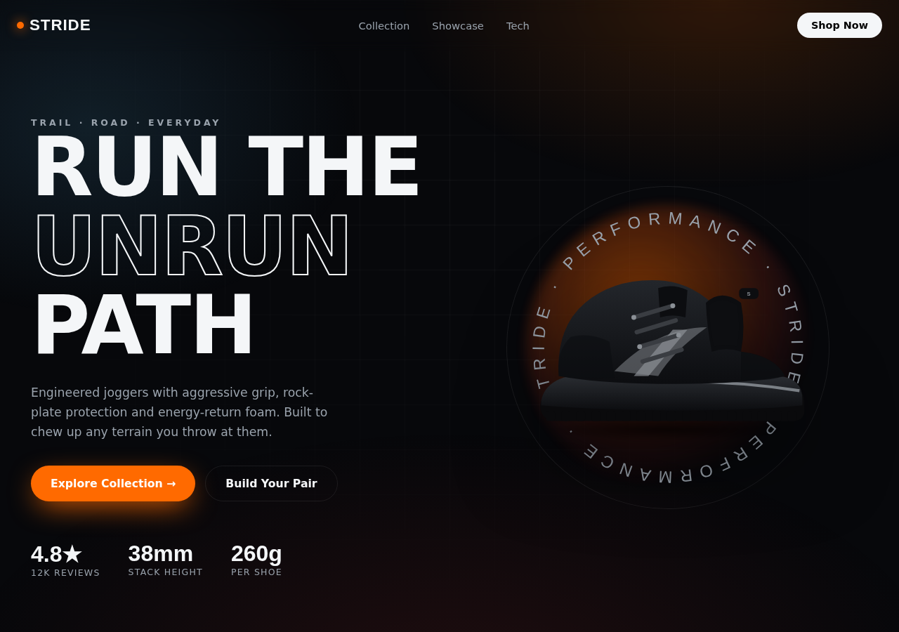

# STRIDE — Animated Sportswear / Joggers Site

A high-energy single-page landing site for trail & running sneakers, built with
**React + Vite + Framer Motion**. Packed with scroll-driven animation, parallax,
hover micro-interactions, a 3D-tilt product grid and an interactive
drag-to-spin shoe configurator.



## Highlights

| Section | Animation |
| --- | --- |
| **Scroll progress bar** | Spring-smoothed top bar driven by `useScroll` |
| **Hero** | Parallax shoe, floating bob, orbiting text ring, glow blob, staggered intro |
| **Marquee** | Infinite looping feature ticker |
| **Collection** | 3D mouse-tracking tilt cards, per-colorway glow, scroll reveal |
| **Showcase** | Drag-to-spin shoe, animated colorway dial, `AnimatePresence` swaps |
| **Tech / Features** | Staggered scroll-in cards with hover lift |
| **CTA + Footer** | Gradient headline, viewport-triggered reveals |

Respects `prefers-reduced-motion`.

## Run it

```bash
cd sportswear-site
npm install
npm run dev      # http://localhost:5173
npm run build    # production build to /dist
npm run preview  # preview the build
```

## Using your own shoe photos

The shoes currently shown are **stylised SVG placeholders** generated by
`scripts/gen-shoes.mjs`. To use your real product photography, drop transparent
PNGs (or photos) into `public/shoes/` using these exact filenames — no code
changes needed:

```
public/shoes/shoe-black.svg    →  Stealth Black  (ULTRA Trail)
public/shoes/shoe-red.svg      →  Crimson Fade   (EMBER Trail)
public/shoes/shoe-orange.svg   →  Solar Orange   (BLAZE Trail)
public/shoes/shoe-blue.svg     →  Sky Blue       (GLACIER Run)
public/shoes/shoe-camo.svg     →  Graphite Camo  (CARBON Air)
```

For best results use **PNGs with a transparent background**, side or 3/4 angle,
roughly square. If you switch to `.png`, update the `image` paths in
`src/data/products.js` (e.g. `shoe-black.png`). Product names, prices, badges
and accent colours all live in that same file.

## Tech stack

- React 18
- Vite 5
- Framer Motion 11
- Zero UI framework — hand-written CSS in `src/index.css`
